# Document Automation Platform: Reference Architecture

Last updated: 2026-05-08

---

## Overview

The Document Automation Platform is a fictional but realistic service used to convert user-submitted Markdown, templates, and structured data into branded PDF reports. This example document is designed for testing `markpdf` output quality across normal Markdown and a wide variety of Mermaid diagram types.

The platform supports:

- Markdown-to-PDF rendering with syntax highlighting and diagram generation.
- Template-driven report assembly for recurring business workflows.
- API and browser-based submission paths.
- Background workers for long-running rendering jobs.
- Auditable storage for source documents, generated artifacts, and operational events.

> Architecture documents should explain intent, not just inventory components. Every section below describes a tradeoff, an operational behavior, or a boundary that a reviewer can validate.

---

## Goals and Non-Goals

| Category | Description | Success measure |
|----------|-------------|-----------------|
| Rendering quality | Produce consistent PDFs from Markdown, Mermaid, tables, and code blocks. | Golden visual snapshots remain stable across releases. |
| Operational reliability | Keep ingestion responsive while rendering happens asynchronously. | API p95 latency stays below 300 ms for accepted jobs. |
| Security | Isolate untrusted Markdown from infrastructure and customer data. | Render workers run without database write credentials. |
| Observability | Make failures actionable for support and engineering teams. | Every job has correlated logs, metrics, and trace IDs. |

Non-goals:

- The platform does not provide collaborative editing.
- The platform does not host arbitrary public websites.
- The platform does not execute user-provided JavaScript.
- The platform does not guarantee pixel-identical output across all browser engines.

---

## System Context

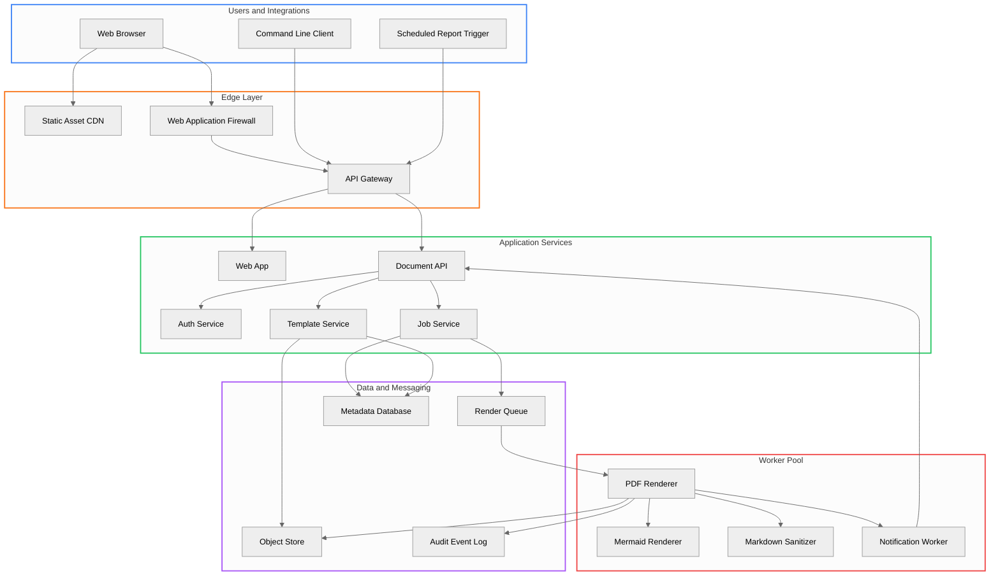

The key design choice is to split acceptance from rendering. The API validates requests, stores immutable source inputs, and enqueues work. Rendering happens in isolated workers that can be scaled, restarted, and sandboxed independently.

---

## Request Lifecycle

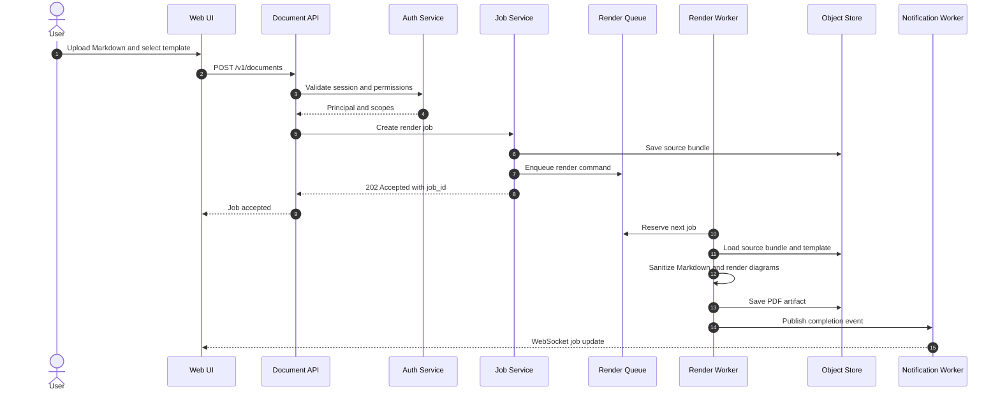

### Lifecycle Notes

1. The initial request returns `202 Accepted` because PDF rendering can take several seconds.
2. Source bundles are immutable after submission, which makes re-rendering and audits reproducible.
3. Worker retries are idempotent because output keys are derived from `job_id` and `attempt`.
4. Completion events are eventually consistent; clients can always poll `GET /v1/jobs/{job_id}`.

---

## Domain Model

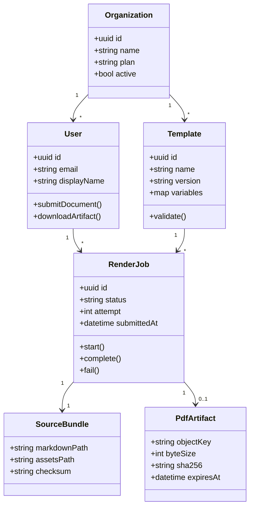

The model intentionally separates `SourceBundle` from `PdfArtifact`. This allows a job to be inspected even when rendering fails before an artifact exists.

---

## Job State Machine

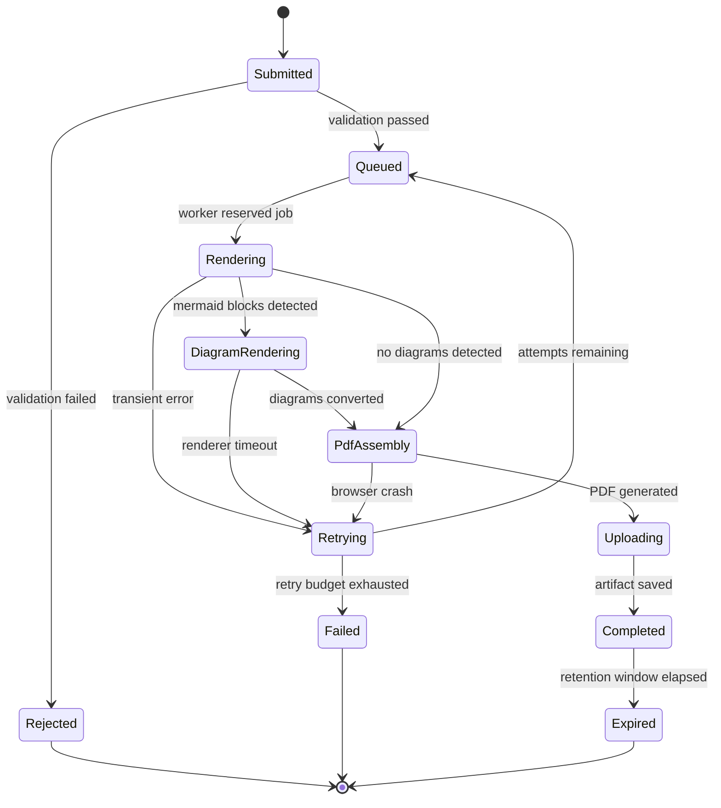

Statuses are persisted after each transition. A worker can crash between transitions without corrupting the job record because the queue lease eventually expires and another worker can retry the job.

---

## Storage Schema

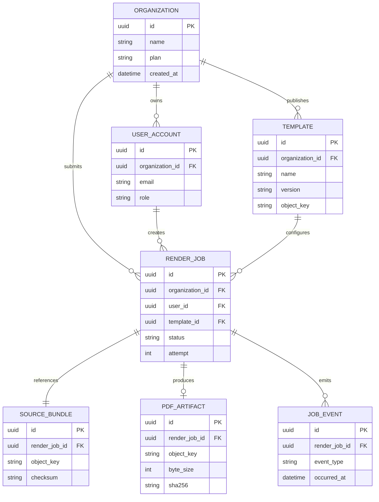

---

## User Journey

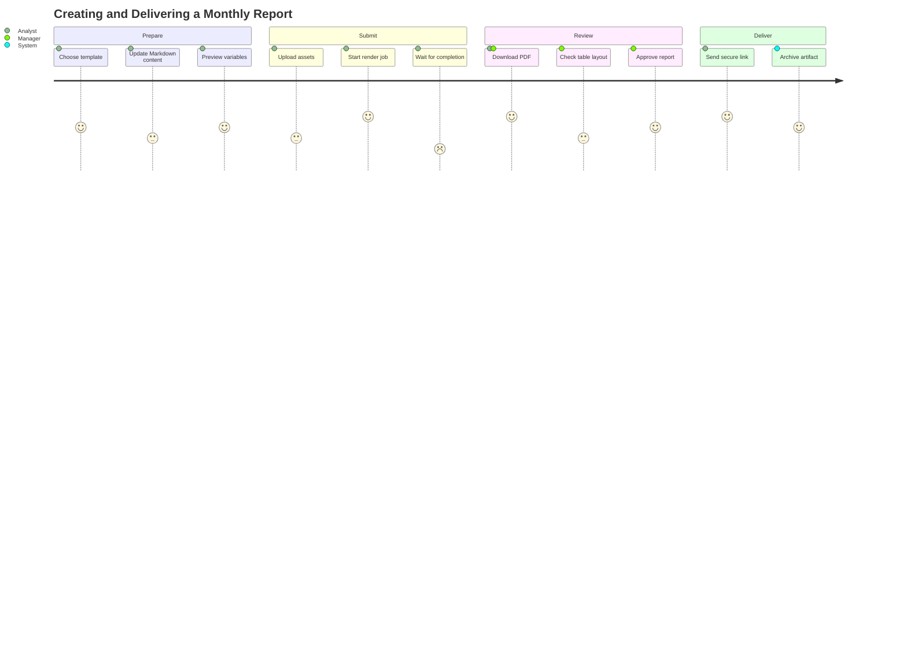

The lowest satisfaction point is waiting for completion. The UI therefore shows progress states, recent worker activity, and a fallback polling link.

---

## Delivery Plan

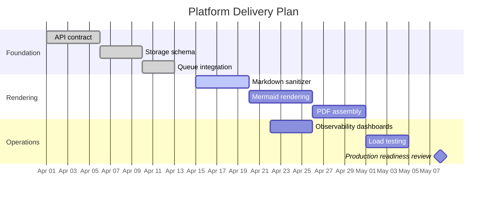

---

## Workload Distribution

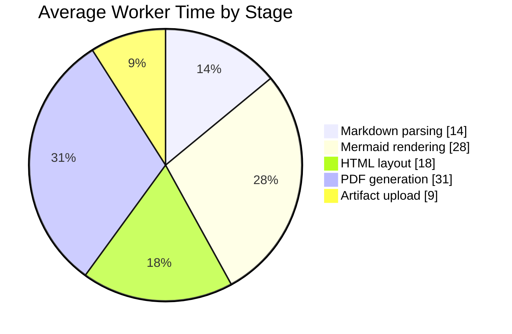

Mermaid rendering and PDF generation dominate worker time, so these stages receive the tightest timeout and memory metrics.

---

## Architecture Mindmap

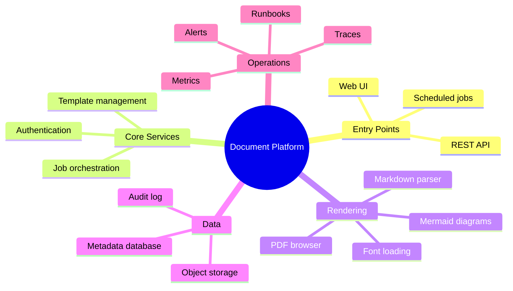

---

## Release Timeline

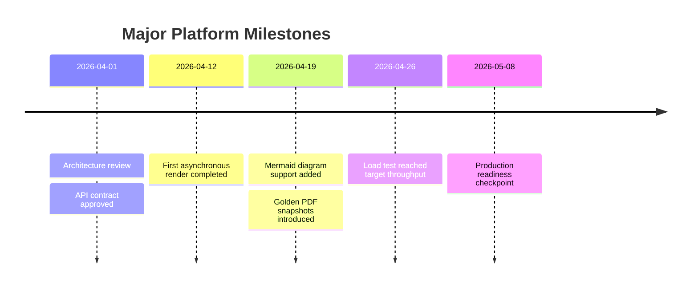

---

## Technology Tradeoffs

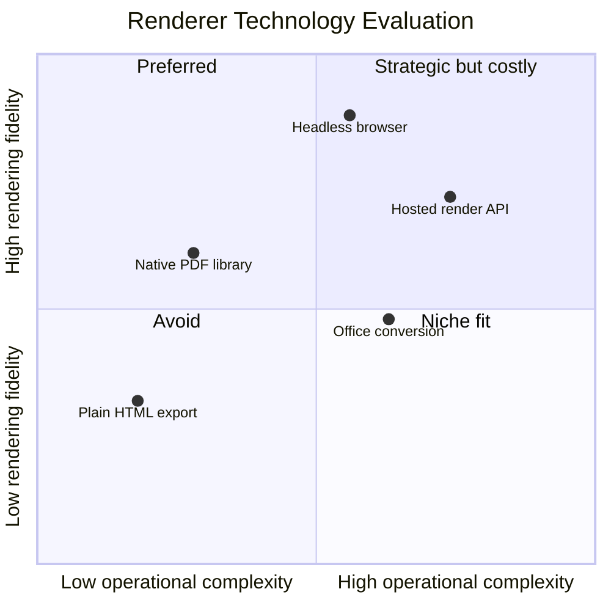

The reference design uses a headless browser because CSS layout, SVG diagrams, and font handling are closer to the final user experience than low-level PDF drawing APIs.

---

## Requirements Traceability

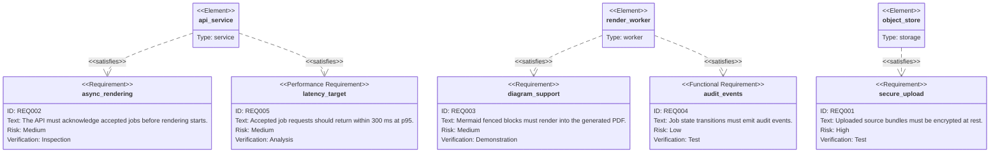

---

## Version Control Flow

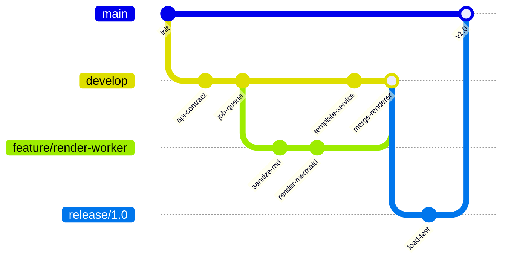

The diagram describes a typical release flow: feature work merges into `develop`, release hardening happens on a release branch, and production releases merge into `main`.

---

## Component Responsibilities

| Component | Owns | Does not own |
|-----------|------|--------------|
| Web App | Upload experience, previews, job status display | PDF rendering internals |
| Document API | Request validation, authorization, job creation | Long-running render execution |
| Job Service | Job state transitions, retry policy, event emission | Template authoring |
| Template Service | Template metadata, versioning, variable schema | User authentication |
| Render Worker | Sanitization, diagram rendering, PDF assembly | Accepting public traffic |
| Object Store | Source bundles, template assets, PDF artifacts | Queryable business state |

---

## API Sketch

The public API is intentionally small. Most client workflows can be implemented with these endpoints:

```http
POST /v1/documents HTTP/1.1
Content-Type: multipart/form-data
Authorization: Bearer <token>

markdown=@report.md
template_id=tpl_standard_report
variables={"period":"2026-Q2","owner":"Example Team"}
```

```json
{
  "job_id": "job_01HX3Q8JZ6V4A7B9N2C5D1E0F3",
  "status": "queued",
  "links": {
    "self": "/v1/jobs/job_01HX3Q8JZ6V4A7B9N2C5D1E0F3",
    "events": "/v1/jobs/job_01HX3Q8JZ6V4A7B9N2C5D1E0F3/events"
  }
}
```

```yaml
retry_policy:
  max_attempts: 3
  backoff:
    type: exponential
    initial_seconds: 15
    max_seconds: 300
  retryable_errors:
    - renderer_timeout
    - browser_crash
    - object_store_throttle
```

The same section intentionally includes aliases that authors commonly use in wiki pages and API docs.

```api
GET /v1/jobs/job_01HX3Q8JZ6V4A7B9N2C5D1E0F3 HTTP/1.1
Accept: application/json
Authorization: Bearer <token>
```

```response
HTTP/1.1 200 OK
Content-Type: application/json

{
  "job_id": "job_01HX3Q8JZ6V4A7B9N2C5D1E0F3",
  "status": "rendering",
  "progress": {
    "stage": "mermaid",
    "completed_blocks": 12,
    "total_blocks": 18
  }
}
```

```partial
<header class="document-header">
  <h1>{{ title }}</h1>
  {{#if owner}}
    <p class="owner">{{ owner }}</p>
  {{/if}}
</header>
```

---

## Security Boundaries

| Boundary | Control | Rationale |
|----------|---------|-----------|
| Internet to gateway | TLS, WAF rules, request size limits | Reject obvious abuse before application code runs. |
| Gateway to API | JWT validation and route-level authorization | Keep authentication decisions centralized. |
| API to queue | Managed identity with enqueue-only permission | Prevent API from consuming or deleting work items. |
| Worker to database | Read-only metadata access | Workers should not mutate business records directly. |
| Worker to object store | Scoped read/write prefixes | A compromised worker can only access assigned artifacts. |
| Observability export | Redaction processor | Prevent source document content from appearing in logs. |

Security assumptions:

- Uploaded Markdown is untrusted input.
- Embedded HTML is sanitized before rendering.
- External images are blocked unless an allowlist is configured.
- Secrets are never passed through template variables.

---

## Operational Runbook Summary

| Symptom | First check | Likely mitigation |
|---------|-------------|-------------------|
| Jobs stay queued | Worker replica count and queue depth | Scale workers or clear stuck leases. |
| Jobs fail during diagrams | Mermaid renderer logs | Validate syntax and increase diagram timeout only if needed. |
| PDFs miss fonts | Font cache and asset fetch metrics | Rebuild worker image with required font package. |
| API latency spikes | Database connection pool saturation | Increase pool size or shed expensive status queries. |
| Artifact downloads fail | Object store permissions and signed URL clock skew | Rotate credentials and verify system time. |

Example diagnostic command:

```commands
markpdf examples/architecture.md \
  --output /tmp/architecture.pdf \
  --theme modern \
  --toc
```

```pwsh
$job = Invoke-RestMethod -Method Get `
  -Uri "https://api.example.test/v1/jobs/$JobId" `
  -Headers @{ Authorization = "Bearer $Token" }

$job.status
```

---

## Design Decisions

### Asynchronous Rendering

Rendering is asynchronous because document complexity is user-controlled. A short report may finish in under a second, while a diagram-heavy report can require multiple browser passes.

### Immutable Inputs

Every submitted source bundle is stored with a checksum. If a report output needs investigation, support can re-render the exact original inputs against the current or historical renderer.

### Sandboxed Workers

Render workers run with a restricted network policy. They can read source bundles, fetch approved assets, write artifacts, and emit telemetry. They cannot call administrative APIs.

### Diagram Rendering as a First-Class Stage

Mermaid blocks are extracted and rendered before PDF assembly. This makes diagram failures explicit instead of hiding them as missing images in the final PDF.

---

## Risks and Mitigations

| Risk | Impact | Mitigation |
|------|--------|------------|
| Large diagrams exceed page width | PDF output becomes unreadable | Apply max-width scaling and include overflow tests. |
| Browser upgrades change layout | Golden PDFs drift unexpectedly | Pin browser versions and review visual diffs. |
| User content includes malicious HTML | Credential or data exposure | Sanitize HTML and disable script execution. |
| Queue backlog delays reports | Users miss delivery windows | Autoscale workers and expose estimated completion time. |
| Object storage outage blocks downloads | Completed jobs appear unavailable | Retry signed URL generation and document degraded mode. |

---

## Appendix: Markdown Rendering Samples

::: note
Azure DevOps note blocks should render as styled admonitions rather than code blocks.
:::

::: warning
Queue backlog warnings should stay visible in generated operational runbooks.
:::

### Math Rendering

```math
\int_0^1 x^2\,dx = \frac{1}{3}
```

### Syntax Highlighting

```go
type RenderJob struct {
    ID      string
    Status  string
    Attempt int
}

func (j RenderJob) Retryable() bool {
    return j.Status == "failed" && j.Attempt < 3
}
```

### Mermaid Error Placeholder

This intentionally invalid diagram verifies that one broken block is visible in the PDF without aborting the whole conversion.

```mermaid
flowchart LR
    A -->
```

### Diagram Sizing Cases

Small diagrams should not stretch into comically large artwork.

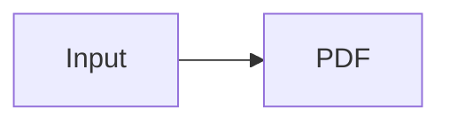

Wide diagrams should scale to the printable width instead of clipping at the page edge.

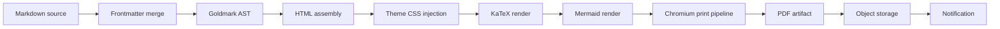

Tall diagrams should stay readable and avoid page breaks where the page can fit them.

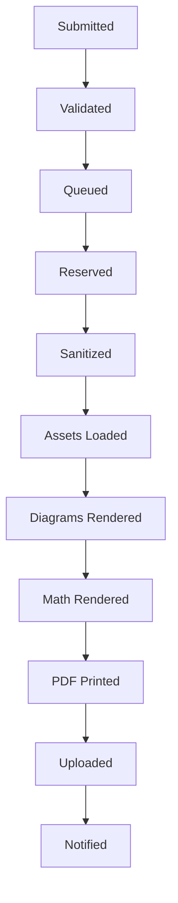

### Nested Content in Lists

- A report can include normal prose, tables, and diagrams.
- A template can define required variables such as `title`, `period`, and `owner`.
- A render job can include optional settings:
  - `page_size`: `Letter` or `A4`
  - `orientation`: `portrait` or `landscape`
  - `include_toc`: `true` or `false`

### Table With Alignment

| Stage | Owner | Timeout | Retryable |
|:------|:------|--------:|:---------:|
| Sanitize Markdown | Worker | 10 s | No |
| Render Mermaid | Worker | 30 s | Yes |
| Assemble PDF | Worker | 60 s | Yes |
| Upload Artifact | Worker | 15 s | Yes |

### Wide Table Wrapping

| Artifact | Storage Key | Description | Operational Note |
|:---------|:------------|:------------|:-----------------|
| Source bundle | organizations/demo/jobs/job-01/source/source-bundle-with-a-very-long-name-used-to-test-wrapping.tar.gz | Immutable Markdown, images, and template variables captured at submission time. | This column intentionally contains enough text to validate line wrapping inside table cells without forcing the table off the printable page. |
| Rendered PDF | organizations/demo/jobs/job-01/artifacts/document-architecture-reference-rendered-with-wide-diagrams.pdf | Final generated artifact returned to users and downstream integrations. | Rows should avoid splitting across pages unless the row is taller than the printable area. |
| Diagnostics | organizations/demo/jobs/job-01/diagnostics/render-attempt-0003.json | Structured render logs, failed block metadata, and browser timing information. | Long object keys and diagnostic descriptions should wrap cleanly. |

### Blockquote With Code

> If a Mermaid diagram fails, the renderer should include a clear placeholder in the PDF and attach the original diagram text to the job diagnostics.

### Azure DevOps Mermaid Fence

Azure DevOps commonly uses `:::` fences for Mermaid blocks. `markpdf` normalizes this form so shared wiki content can render without conversion.

::: mermaid
flowchart LR
    Wiki["Azure DevOps Wiki"]
    Parser["markpdf parser"]
    Goldmark["Markdown pipeline"]
    Browser["Headless Chromium"]
    PDF["Rendered PDF"]

    Wiki --> Parser --> Goldmark --> Browser --> PDF
:::

```text
Diagram render failed:
  job_id: job_01HX3Q8JZ6V4A7B9N2C5D1E0F3
  block_index: 7
  reason: syntax_error
```

---

## Review Checklist

- The architecture separates request acceptance from rendering.
- Workers can be scaled independently from API servers.
- Markdown input is treated as untrusted content.
- PDF artifacts are reproducible from immutable source bundles.
- Every Mermaid block in this document should render or fail visibly during `markpdf` testing.
